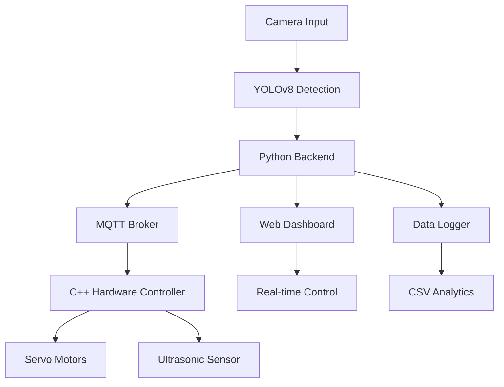

<h1 align="center">🤖 Smart Robotic Arm with Vision Tracking</h1>

<p align="center">
  
  
  
  
  
  
  <a href="LICENSE">
    
  </a>
</p>

<p align="center">
  
</p>

<p align="center">
  <em>Comprehensive robotic arm system with real-time computer vision, dual control modes, and web dashboard for Raspberry Pi 5</em>
</p>

---

## 🌟 Features

- **🎯 Vision Tracking**: Real-time object detection using YOLOv8/OpenCV with automatic grabbing
- **🎮 Dual Control Modes**: Seamless switching between automatic vision-based and manual web control
- **📊 Web Dashboard**: Real-time monitoring interface with dark/light themes and mobile support
- **📈 Data Analytics**: CSV logging with Jupyter notebook analysis and performance insights
- **🔄 MQTT Communication**: Wireless control and status updates with WebSocket support
- **⚡ Hybrid Architecture**: C++ for real-time hardware control, Python for AI processing
- **🛡️ Safety Features**: Emergency stop, position limits, and comprehensive error handling

## 🏗️ Architecture



## 📁 Project Structure

```
smart-robotic-arm/
├── 📂 src/                     # C++ hardware control
│   ├── main.cpp               # Main control loop & MQTT
│   ├── servo_control.cpp      # 5-axis servo control
│   ├── sensor_ultrasonic.cpp  # Distance measurement
│   └── driver_motor.cpp       # Motor driver interface
├── 📂 include/                # C++ headers & config
│   └── config.h              # GPIO pins & parameters
├── 📂 Backend python/         # Python AI & web backend
│   ├── main.py               # Flask server & WebSocket
│   ├── vision_tracking.py    # YOLOv8 object detection
│   ├── data_logger.py        # CSV logging & analytics
│   ├── analysis.ipynb        # Jupyter data analysis
│   └── requirements.txt      # Python dependencies
├── 📂 dashboard/              # Web interface
│   ├── index.html            # Main dashboard UI
│   ├── page.js               # Control logic & charts
│   ├── style.css             # Modern responsive design
│   └── assets/               # Icons & images
├── 📂 data/                   # Datasets & logs
│   ├── dataset.csv           # Operation history
│   └── images/               # Captured frames
├── 📂 docs/                   # Documentation
│   ├── API.md                # REST & WebSocket API
│   ├── HARDWARE.md           # Wiring & assembly
│   ├── TROUBLESHOOTING.md    # Common issues
│   └── README.zh-en.md       # English documentation
├── 📂 scripts/                # Utility scripts
│   ├── health_check.sh       # System diagnostics
│   ├── start_system.sh       # Launch all services
│   └── stop_system.sh        # Graceful shutdown
├── 🔧 CMakeLists.txt           # C++ build configuration
├── 🚀 setup.sh                # Automated installation
└── 📋 CITATION.cff            # Academic citation
```

## 🚀 Quick Start

### 1. Clone Repository
```bash
git clone https://github.com/ficrammanifur/smart-robotic-arm.git
cd smart-robotic-arm
```

### 2. Automated Setup
```bash
# Make setup script executable
chmod +x setup.sh

# Run automated installation
./setup.sh

# Reboot system
sudo reboot
```

### 3. Hardware Assembly
```bash
# Check hardware guide
cat docs/HARDWARE.md

# Test connections
./scripts/health_check.sh
```

### 4. Launch System
```bash
# Start all services
./scripts/start_system.sh

# Access dashboard
# Open http://localhost:5000 in browser
```

### 5. Manual Installation (Advanced)
```bash
# System dependencies
sudo apt update && sudo apt install -y cmake build-essential wiringpi
sudo apt install -y python3-pip python3-venv libopencv-dev mosquitto

# Build C++ components
mkdir build && cd build
cmake .. && make -j4

# Python environment
cd "Backend python"
python3 -m venv venv && source venv/bin/activate
pip install -r requirements.txt
```

## 📊 System Performance

| Component | Specification | Performance | Power |
|-----------|--------------|-------------|-------|
| Detection | YOLOv8n 640px | 85.3% mAP, 30 FPS | 2.1W |
| Servos | 5x SG90/MG996R | 180° range, 0.1s/60° | 1.5W each |
| Processing | Raspberry Pi 5 | Quad-core 2.4GHz | 5-8W |
| Total System | Real-time control | <100ms latency | ~15W |

## 🛠️ Hardware Requirements

### Essential Components
- **🖥️ Raspberry Pi 5** (4GB+ RAM recommended)
- **🦾 5x Servo Motors** (SG90 or MG996R for higher torque)
- **📡 Ultrasonic Sensor** (HC-SR04 for distance measurement)
- **⚙️ Motor Driver** (L298N or compatible)
- **📷 Camera Module** (Pi Camera v3 or USB webcam)

### Power & Connectivity
- **🔌 Power Supply**: 5V 4A for Pi + 6V 2A for servos
- **🔗 Breadboard** or custom PCB for connections
- **📱 MicroSD Card** (32GB+ Class 10 for optimal performance)

## 🎮 Control Modes

### 🤖 Automatic Mode
- Real-time object detection and tracking
- Autonomous grabbing sequences
- Collision avoidance with ultrasonic sensor
- Performance logging and optimization

### 🎯 Manual Mode
- Web dashboard servo control
- Keyboard shortcuts (↑↓←→, Space, Esc)
- Real-time position feedback
- Emergency stop functionality

## 📈 Configuration

### Hardware Setup (`include/config.h`)
```cpp
// GPIO Pin Assignments (BCM)
#define SERVO_BASE_PIN 18      // Base rotation
#define SERVO_SHOULDER_PIN 19  // Shoulder joint
#define SERVO_ELBOW_PIN 20     // Elbow joint
#define SERVO_WRIST_PIN 21     // Wrist rotation
#define SERVO_GRIPPER_PIN 22   // Gripper control

// Detection Parameters
#define DETECTION_CONFIDENCE 0.5
#define MAX_OBJECTS 10
```

### Vision Settings (`Backend python/main.py`)
```python
# Camera Configuration
CAMERA_WIDTH = 640
CAMERA_HEIGHT = 480
FPS_TARGET = 30

# YOLO Parameters
CONFIDENCE_THRESHOLD = 0.25
IOU_THRESHOLD = 0.45
```

## 🔧 API Documentation

### REST Endpoints
- **GET** `/api/status` - System health and statistics
- **POST** `/api/control` - Send movement commands
- **GET** `/api/detections` - Current object detections
- **GET** `/api/logs` - Operation history

### WebSocket Events
- `status` - Real-time system updates
- `detections` - Object detection events
- `control` - Manual control commands
- `emergency` - Safety alerts

### MQTT Topics
- `smartarm/control` - Command input
- `smartarm/status` - Status broadcasts
- `smartarm/data` - Sensor readings

## 🔍 Troubleshooting

### Common Issues

**🚫 Hardware Not Detected**
```bash
# Check GPIO permissions
sudo usermod -a -G gpio $USER
./scripts/health_check.sh
```

**📷 Camera Issues**
```bash
# Verify camera connection
vcgencmd get_camera
libcamera-hello --timeout 5000
```

**🌐 Dashboard Not Loading**
```bash
# Check Python backend
cd "Backend python" && python main.py --debug
netstat -tulpn | grep :5000
```

**⚡ Performance Issues**
- Use Class 10+ SD card
- Increase GPU memory: `gpu_mem=128`
- External servo power supply
- Optimize camera resolution

## 🤝 Contributing

1. Fork the repository
2. Create feature branch (`git checkout -b feature/amazing-feature`)
3. Follow code style guidelines (Black for Python, clang-format for C++)
4. Add tests and documentation
5. Submit pull request

## 📄 License

This project is licensed under the MIT License - see the [LICENSE](LICENSE) file for details.

## 🙏 Acknowledgments

- [Ultralytics YOLOv8](https://github.com/ultralytics/ultralytics) for object detection framework
- [OpenCV](https://opencv.org/) for computer vision utilities
- [Raspberry Pi Foundation](https://www.raspberrypi.org/) for the amazing hardware platform
- [Chart.js](https://www.chartjs.org/) for dashboard data visualization
- [MQTT.js](https://github.com/mqttjs/MQTT.js) for real-time communication

---

<div align="center">
  <p>⭐ Star this repository if you find it useful!</p>
  <p>🤖 Built with ❤️ for the robotics community</p>
  <p><a href="#top">⬆ Back to Top</a></p>
</div>
